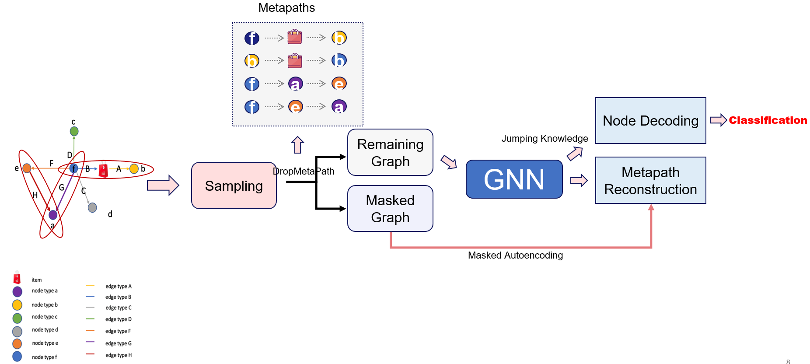

# ICDM 2022: Risk Commodities Detection on Large-Scale E-Commence Graphs


---

[[Slides]](./slides.pdf)


This is the 3rd place solution for [ICDM 2022: Risk Commodities Detection on Large-Scale E-Commence Graphs Competition](https://tianchi.aliyun.com/competition/entrance/531976/introduction). 


# Introduction
Recently, graph computing technologies, especially graph neural networks, have gained rapid development as well as wide application.

In the risk commodity detection scenario on e-commerce platforms, there is a fierce confrontation between attackers and risk detection systems. Malicious users always deliberately disguise risk information in order to avoid platform detection. By introducing graph data, we can alleviate the performance decline caused by the confrontation of malicious users.

In practice, the performance of the graph algorithm is often closely related to the quality of the graph structure. Malicious users usually forge their devices, and addresses to circumvent our detection. How to fully mine risk information in the graph structure data with a lot of noise is a very challenging problem. In addition, heterogeneous graph structure, as well as huge graph scale, are also challenges.

The competition provides a risk commodity detection dataset extracted from real-world risk scenarios at Alibaba. It requires participants to detect risky products using graph algorithms in a large-scale and heterogeneous graph with imbalanced samples.

# Requirements
Higher versions should be also available.

+ Python 3.7.3
+ numpy==1.18.1
+ torch==1.12.1+cu102
+ torch-cluster==1.6.0
+ torch_geometric>=2.1.0
+ torch-scatter==2.0.9
+ torch-sparse==0.6.14
+ torch-spline-conv==1.2.1
+ CUDA 10.2
+ CUDNN 7.6.0


# HeteroGNN
## Model Overview




## Data preparation
+ Creat a folder `/data` in your workspace
+ Download Session I and II datasets from [here](https://tianchi.aliyun.com/competition/entrance/531976/information) and put them in the `data/session`/ and `data/session2`, respectively.
+ Extract zipped graphs: `unzip icdm2022_session1_train.zip` or `unzip icdm2022_session2.zip`
+ Pre-process datasets (see follows)


## Preprocessing
+ Session I
```bash
cd code/
python process_data.py --session 1
```
Then you will get `icdm2022_session1.pt` in `/data` folder.

+  Session II
```bash
cd code/
python process_data.py --session 2
```
Then you will get `icdm2022_session2.pt` in `/data` folder.

NOTE: other unnecessary files are manually removed after pre-processing.

## How to Run the Model

Codes of Session I and Session II are distinguished by their suffixes `_sess1` and `_sess2`.


## Session I

```bash
cd code/
python main_sess1.py --lp --full --n-epoch 30  && python inference_sess1.py --lp 
```
+ Running time ~20min
+ `main_sess1.py` is to train the model and `inference_sess1.py` is to load the model and do inference
+ `--lp` indicates using `Masked Label Propagation` during training and inference
+ `--full` indicates using full training datasets (including validation set)
+ We run 30 epochs in Session I to avoid overfitting

After finished training, there would be two files in `code/` directly:
+ `model_sess1.pth`: trained model
+ `session1_record.txt`: running logs


## Session II
```bash
cd code/
python main_sess2.py --n-epoch 100 --full && python inference_sess2.py
```
+ Running time ~40min
+ `--full` indicates using full training datasets (including validation set)
+ `Masked Label Propagation` is not used in Session II as there are no labels provided


After finished training, there would be two files in `code/` directly:
+ `model_sess2.pth`: trained model
+ `session2_record.txt`: running logs


# File Structures
```bash
ICDM2022_competition_3rd_place_solution
├── code
│   ├── inference_sess1.py
│   ├── inference_sess2.py
│   ├── logger.py
│   ├── main_sess1.py
│   ├── main_sess2.py
│   ├── metapath.py
│   ├── model_sess1.py
│   ├── model_sess2.py
│   ├── process_data.py
├── data
│   ├── session1
│   │   ├── icdm2022_session1.pt
│   │   ├── icdm2022_session1_test_ids.txt
│   │   └── Readme.md
│   └── session2
│       ├── icdm2022_session2.pt
│       ├── icdm2022_session2_test_ids.txt
├── README.md
└── submit

```